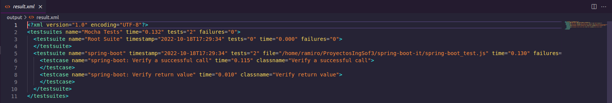

# Trabajo Práctico 10 - Pruebas de Integración

## Desarrollo 

### 2- Testeando la página de GitHub

Luego de instalar e iniciar todo, modifico el primer test:

```
Feature('github');

Scenario('test something', ({ I }) => {
    I.amOnPage('https://github.com');
    I.see('GitHub');
}); 
```

Ahora corro el primer test:

```
ramiro@XENIA-14:~/ProyectosIngSof3/ut$ npx codeceptjs run --steps
context
CodeceptJS v3.3.6 #StandWithUkraine
Using test root "/home/ramiro/ProyectosIngSof3/ut"

github --
  test something
    I am on page "https://github.com"
    I see "GitHub"
  ✔ OK in 2147ms

``` 

Luego de modificar el test lo corro nuevamente:

```
ramiro@XENIA-14:~/ProyectosIngSof3/ut$ npx codeceptjs run --steps
context
CodeceptJS v3.3.6 #StandWithUkraine
Using test root "/home/ramiro/ProyectosIngSof3/ut"

github --
  test something
    I am on page "https://github.com"
    I see "GitHub"
    I see "The home for all developers"
    I scroll page to bottom 
    I see element "//li[contains(.,'© 2022 GitHub, Inc.')]"
  ✔ OK in 1968ms

```

### 3- Testeando la aplicación spring-boot

Luego de realizar las instalaciones y los cambios indicados corro el test:

```
ramiro@XENIA-14:~/ProyectosIngSof3/spring-boot-it$ npx codeceptjs run --steps
CodeceptJS v3.3.6 #StandWithUkraine
Using test root "/home/ramiro/ProyectosIngSof3/spring-boot-it"

spring-boot --
  Verify a successful call
    I send get request "/"
  ✔ OK in 57ms

  Verify return value
    I send get request "/"
  ✔ OK in 17ms

```

Con este simple test podemos corroborar que efectivamente estamos corriendo spring boot en localhost y que reacciona como esperamos.

### 4 - Habilitar reportes para utilizarlos en CI/CD

Instalado el módulo de reporting y modificado el archivo, corremos el comando `npx codeceptjs run --steps --reporter mocha-multi`:

```
ramiro@XENIA-14:~/ProyectosIngSof3/spring-boot-it$ npx codeceptjs run --steps --reporter mocha-multi
CodeceptJS v3.3.6 #StandWithUkraine
Using test root "/home/ramiro/ProyectosIngSof3/spring-boot-it"

spring-boot --
  Verify a successful call
    I send get request "/"
  ✔ OK in 115ms

  Verify return value
    I send get request "/"
  ✔ OK in 10ms

```

Y el archivo de salida se ve de la siguiente manera:



### 5 - Integrar la ejecución en Jenkins

TODO: Crear un container de spring-boot, crear un bridge network y permitir que se comuniquen el container de jenkins con el de spring-boot para que los test apunten a ese puerto