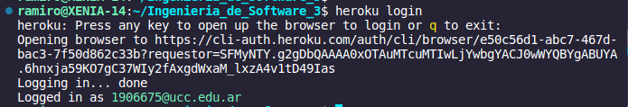
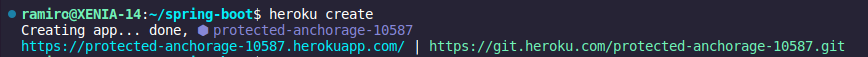
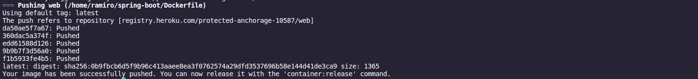
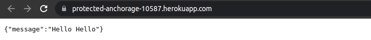

# Trabajo Práctico 12 - Despliegue de aplicaciones

### 1 - Configurando Heroku



### 2 - Creando y Desplegando la aplicación Payroll

Modifico el Dockerfile: 

```dockerfile
FROM maven:3.5.2-jdk-8-alpine AS MAVEN_TOOL_CHAIN
COPY pom.xml /tmp/
RUN mvn -B dependency:go-offline -f /tmp/pom.xml -s /usr/share/maven/ref/settings-docker.xml
COPY src /tmp/src/
WORKDIR /tmp/
RUN mvn -B -s /usr/share/maven/ref/settings-docker.xml package

FROM openjdk:8-jre-alpine

ENV PORT=8080

EXPOSE 8080

RUN mkdir /app
COPY --from=MAVEN_TOOL_CHAIN /tmp/target/*.jar /app/spring-boot-application.jar

CMD ["java", "-Xms32m", "-Xmx128m", "-jar", "-Dserver.port=${PORT}", "-Djava.security.egd=file:/dev/./urandom", "/app/spring-boot-application.jar"] 

```

Creamos:



Ahora, antes de poder generar y subir la imagen de Docker a Heroku tuve que correr el comando ` heroku container:login` para que me permitiera subir la imagen.

Ahora si: 



```bash
ramiro@XENIA-14:~/spring-boot$ heroku container:release web --app=protected-anchorage-10587
Releasing images web to protected-anchorage-10587... done

```



### 3 - Integrar el despliegue en Jenkins

