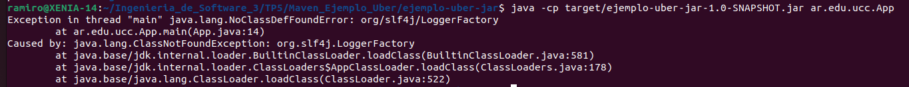

# Trabajo Práctico 5 - Herramientas de construcción de software

## Desarrollo 

### Introducción a Maven

1. ¿Qué es Maven?

Maven es una herramienta que se utiliza para la construcción  y administración de proyectos basados en Java.

El objetivo principal de Maven es permitir que un desarrollador comprenda el estado completo de un esfuerzo de desarrollo en el menor tiempo posible. Para lograr este objetivo, Maven se ocupa de varias áreas de preocupación:

* Facilitando el proceso de construcción
* Proporcionar un sistema de construcción uniforme
* Proporcionar información de proyectos de calidad.
* Fomentar mejores prácticas de desarrollo

2. ¿Qué es el archivo POM?

POM (Project Object Model) es la unidad de trabajo fundamental en Maven. Es un archivo XML que contiene información sobre el proyecto y los detalles de configuración utilizados por Maven para construir el proyecto. 

- ModelVersion: Especifica el ModelVersion del archivo POM. Esta version depende de la version de Maven, ya que Maven 1.x usa un model version 3.0.0 y tanto Maven 2.x y 3.x usan un model version 4.0.0

- groupId: Define el dominio, el proyecto real al que pertenece el proyecto Maven actual, suele ser único en una organización o proyecto. Cada artifact tiene un groupId.

- artifacId: Define un módulo maven, nombre del artifact sin la versión, generalmente del tipo jar ya que se trata del ejecutable del projecto.

- versionId: especifica la version del artifact.

groupId, artifactId y versionId en conjunto identifican un artifact.

**Nota**: El artifact o artefacto es el ejecutable que se obtiene al finalizar la construcción del proyecto.

3. Repositorios

**Repositorio local:** reside en la computadora donde se ejecuta Maven. Cachea descargas remotas y contiene comtiene artifacts de compilación temporales.

**Repositorio central:** localizado en `http://repo.maven.apache.org/maven2/`. Cuando se compila, maven primero intenta encontrar la dependencia en el repositorio local. Si no esta ahí, por defecto, activa la descarga desde este repositorio central. Es el repositorio remoto por defecto.

**Repositorio remoto:** cualquier otro repositorio al que se accede mediante protocolos como `file://` o `https://`. Siempre que se necesita un artifact de estos repositorios, primero se descarga al repositorio local del desarrollador y luego se utiliza.

4. Entender Ciclos de vida de build

    - default: Maneja el deploymenr del proyecto

    - clean: Maneja la limpieza del proyecto, elimina los archivos generados.
    
    - site: Maneja la cración del sitio web del proyecto.

5. Luego de crear el archivo pom.xml y correr `mvn clean install` concluyo que este comando ejecuta la fase clean y luego compienza la compilación desde un estado limpio. Como resultado se instalaron una serie de archivos jar desde el repositorio central y se creó el proyecto maven y el ejecuteble .jar correspondiente a este.

## 4 - Maven Continuación

Luego de correr el comando `mvn archetype:generate -DgroupId=ar.edu.ucc -DartifactId=ejemplo -DarchetypeArtifactId=maven-archetype-quickstart -DinteractiveMode=false`se crearon los siguientes directorios:


Podemos obsevar que el directorio principal es el Id del artifact y que se crearon directorios siguiendo los parámetros de DgroupId.

A la salida de la ejecución del comando `mvn clean package` obtenemos:


Podemos observar como se crea .jar de manera correcta y supera el test preparado.

Al correr el .jar creado anteriormente:

```
ramiro@XENIA-14:~/Ingenieria_de_Software_3/TP5/MavenContinuacion/ejemplo$ java -cp target/ejemplo-1.0-SNAPSHOT.jar ar.edu.ucc.App
Hello World!
```
Podemos observar como creamos un Hello World! ejecutable con la ayuda de Maven.

## 6- Manejo de dependencias


En este caso, el código no compila debido a un error de dependencias de librerias.



Aún añadiendo las dependencias en el pom.xml la clase que se intenta importar (LoggerFactory) no es encontrada porque esta especificación es útil en el momento de la compilación (lo que justifica que antes de añadir las dependencias a pom.xml no era posible la compilación) pero al momento de linkear la clase no puede ser alcanzada.


Implementando la segunda solución:

