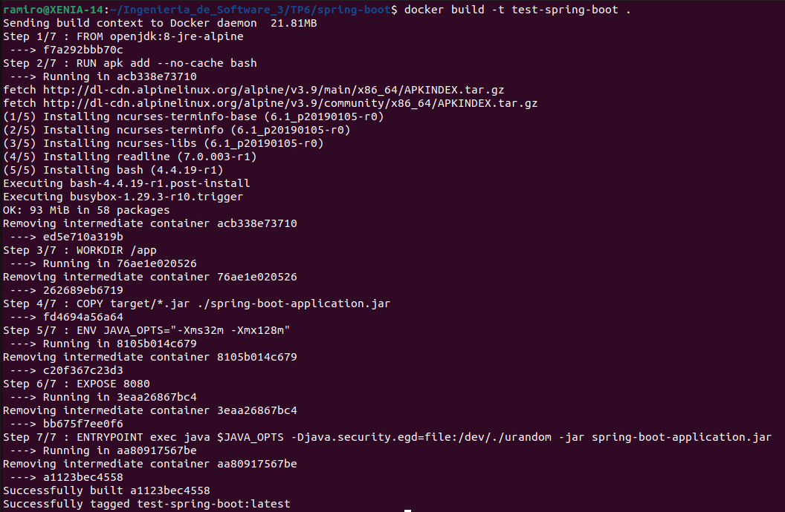
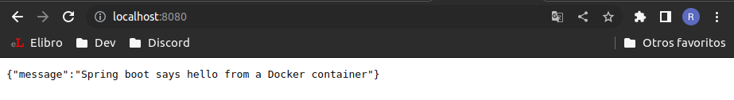
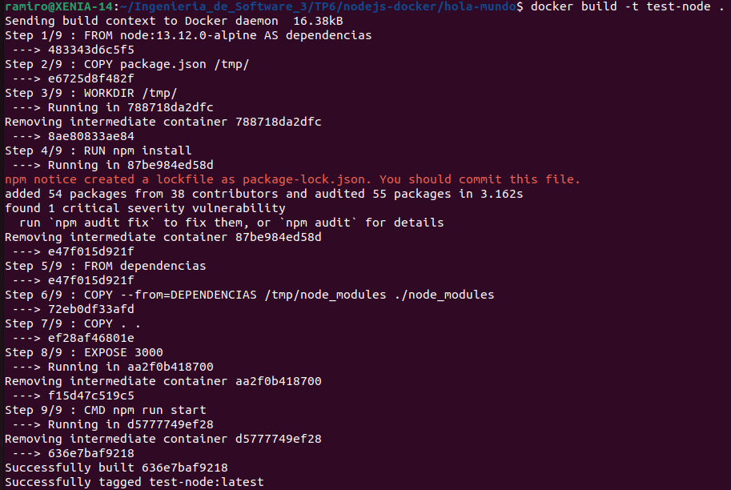
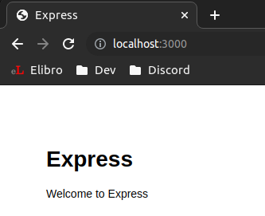
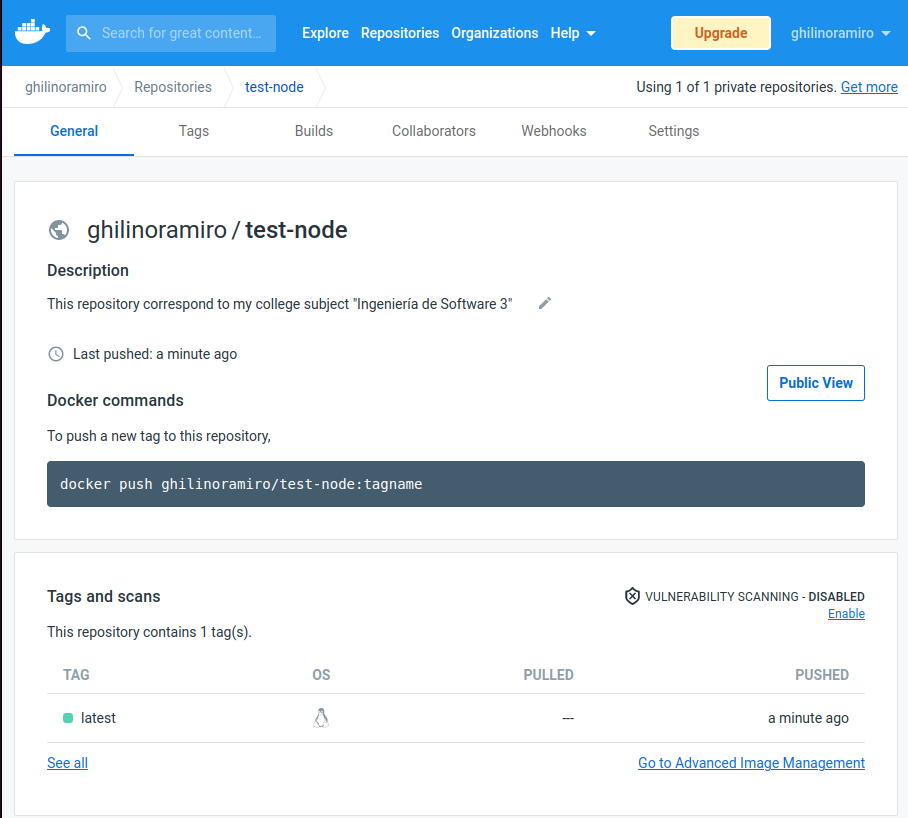

# Trabajo Práctico 6 - Construcción de Imágenes de Docker

## 1 - Conceptos de Dockerfiles

- **FROM [--platform=<platform>] <image> [AS <name>]**

    Un Dockerfile debe comenzar con una instrucción FROM. 

    Lo que hace es inicializar un nuevo escenario de build y setear la `base image` para las siguientes instrucciones.

    `FROM` puede aparecer varias venes en un único docker file para crear multiples imagenes o usae un escenario de build como dependecia de otro.

    La flag --platform puede setearse si FROM referencia una imagen multiplataforma.

- **RUN**

    Esta instrcucción ejecutará cualquier comando en una nueva capa en el tope (parte superior) de la imahen actual y commiteará los resultados para que sean usados en el siguiente paso.

    Tiene dos formas:

    -shell: ``RUN <command>`` (el comando correrá en el shell).

    -exec: ``RUN ["executable, "param1", "param2"]``.


- **ADD**

    Copia nuevos archivos, directorios o archivos remoto desde una fuente `<src>` y los añade a el filesystem de la imagen en la ruta destino `<dest>`.
    `<src>` debe estar dentro del context del build.

    Tiene dos formas:

    -``ADD [--chown=<user>:<group>] <src>... <dest>``.

    -``ADD [--chown=<user>:<group>] ["<src>",... "<dest>"]``.


- **COPY**

    Copia nuevos archivos o directorios desde el path fuente `<src>` y los añade al filesystem del container en el path destido `<dest>`.
    Misma finalidad que `ADD` pero soporta unicamente copiar desde un directorio local del host y no ofrece al funcionalidad de desempaquetar el contido desde un src comprimido.

    Tiene dos formas:

    -``COPY [--chown=<user>:<group>] <src>... <dest>``.

    -``COPY [--chown=<user>:<group>] ["<src>",... "<dest>"]``.

  
- **EXPOSE <port> [<port>/<protocol>...]**

    Informa  que el container escucha en un puerto de la red específico en tiempo de ejcutción. No es que publica en el puerto, funciona como un tipo de documentación entre la persona que construye la imagen y la que ejecuta el container.

- **CMD**

    Tiene tres formas:

    -shell: ``CMD command param1 param2``.

    -exec: ``CMD ["executable","param1","param2"]``.

    -default parameters to entrypoint: ``CMD ["param1","param2"]``.

    Solo puede haber una en un Dockerfile, su propósito es proveer un contenerdor de ejecución por defecto, puede ser incluido u omitido del ejecutable, en el ultimo caso se debe especificar un ENTRYPOINT.


- **ENTRYPOINT**

    Esta instrucción te permite configurar el contenedor que va a correr como un ejecutable. 

    Tiene dos formas:

    -shell: ``ENTRYPOINT command param1 param2``.

    -exec: ``RUN ["executable, "param1", "param2"]``.

    
    Los argumentos pasados en el comando `run` (en la linea de comandos) serán agregados después de todos los elementos en un `exec` desde el `ENTRYPOINT`. Esto permite pasar los elementos al entry point.

    El ENTRYPOINT especifica el ejecutable que usará el contenedor y CMD se corresponde con los parámetros a usar con dicho ejecutable.


## 2 - Generar Imagen de docker

Se modificó la primera línea del archivo `dockerfile`
de `FROM java:8-jre-alpine` a ` FROM openjdk:8-jre-alpine`

 

Luego de ejecutar el contenedor con el comando `docker run -p 8080:8080 test-spring-boot`:




## 3 - Dockerfiles Multi Etapas 

```
#Especifica como imagen base "maven:3.5.2-jdk-8-alpine" y la nombra MAVEN_TOOL_CHAIN
FROM maven:3.5.2-jdk-8-alpine AS MAVEN_TOOL_CHAIN
#Copia el archivo pom.xml a la carpeta /tmp/ del contexto de la imagen
COPY pom.xml /tmp/
#Ejecuta el comando mvn dependency:go-offline en modo no interactivo (-B), el cual resuelve todas las dependencias del proyecto. Usa el parámetro -f para indicar la ubicación del archivo pom.xml y -s para indicar el path del archivo de configuraciones del usuario.
RUN mvn -B dependency:go-offline -f /tmp/pom.xml -s /usr/share/maven/ref/settings-docker.xml
#Copia el contenido de src en el contexto de la imagen.
COPY src /tmp/src/
#Especifica el directorio de trabajo
WORKDIR /tmp/
#Ejecuta el comando mvn package para compilar el proyecto
RUN mvn -B -s /usr/share/maven/ref/settings-docker.xml package

#Acá se lo puede considerar como que empieza otra sección lógica en el Dockerfile, al tener varios FROM lo que conseguimos es una compilación en etapas donde iremos haciendo uso de los resultados de las secciones anteriores para conformar nuestra imagen final. Este FROM define la imagen que los contenedores eventualmente ejecutarán. La imagen presedente se utiliza únicamente como una herramienta práctica para la creación.

FROM java:8-jre-alpine

#Expongo en el puerto 8080
EXPOSE 8080

#Creo un subdirectorio llamado app
RUN mkdir /app
#Copio de la imagen anterior (que nombramos MAVEN_TOLL_CHAIN) los ejecutables especificados.
COPY --from=MAVEN_TOOL_CHAIN /tmp/target/*.jar /app/spring-boot-application.jar

ENV JAVA_OPTS="-Xms32m -Xmx128m"

ENTRYPOINT exec java $JAVA_OPTS -Djava.security.egd=file:/dev/./urandom -jar /app/spring-boot-application.jar

#Le dice a docker como saber si la app es "saludable"
HEALTHCHECK --interval=1m --timeout=3s CMD wget -q -T 3 -s http://localhost:8080/actuator/health/ || exit 1

```

La principal diferencia entre este dockerfile y el anterior es que con este, cuando ejecutemos el build, primero se contruye la applicación (primer sección lógica) y después se usan los ejecutables obtenidos para la creación de la imagen. En el caso anterior la construcción de la aplicación iba por nuestra cuenta y traíamos al contexto de la imagen a contruir los ejecutables .jar ya existentes en nuestro filesystem local.

## 4 - Python FLask

En el archivo `docker-compose` podemos encontrar el elemento `build` que define las opciones de configuración que se aplican al momento de la construcción de la Imagen de Docker. 
Las opciones se pueden enviar como un string o, como en este caso, como un objeto si se utiliza la clave `context`.
`context` se utiliza para indicar el directorio que incluye un `dockerfile`, una url o un repositorio de git. Cuando se indica un path relativo como este caso se parte la ubicación del archivo `docker-compose`. 

Toda esta información se puede encontrar en la [documentación](https://docs.docker.com/compose/compose-file/compose-file-v3/) de Docker.

## 5 - Imagen para aplicación web en Nodejs

El dockerfile creado contiene:

```
FROM node:13.12.0-alpine AS dependencias
COPY hola-mundo/package.json /tmp/
WORKDIR /tmp/
RUN npm install

FROM dependencias
COPY --from=DEPENDENCIAS /tmp/node_modules ./node_modules
COPY . .
EXPOSE 3000
CMD npm run start
```

A continuación podemos ver el comando usado y los output de consola, en la última linea podemos ver como efectivamente se nombró como `test-node`.



Luego de utilizar el comando `docker run -p 3000:3000 test-node` podemos ver como efectivamente corre en el puerto asignado:




## 6 - Publicar la imagen en Docker Hub.

La imagen se encuentra disponible [aquí](https://hub.docker.com/repository/docker/ghilinoramiro/test-node)

Adjunto una captura de todas formas:





    