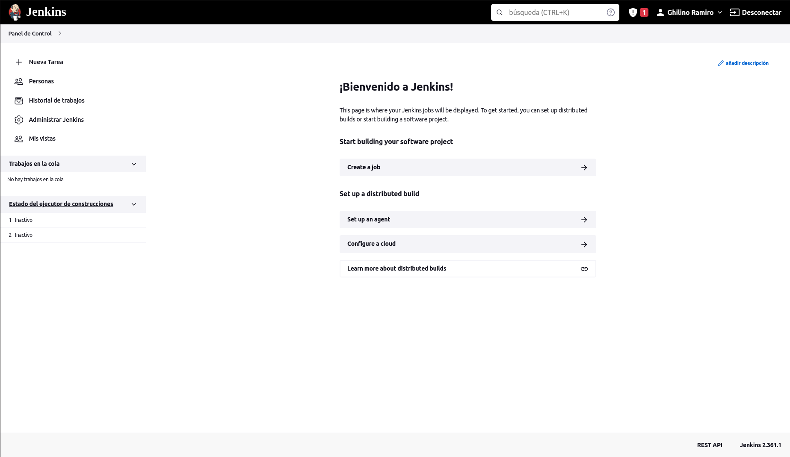
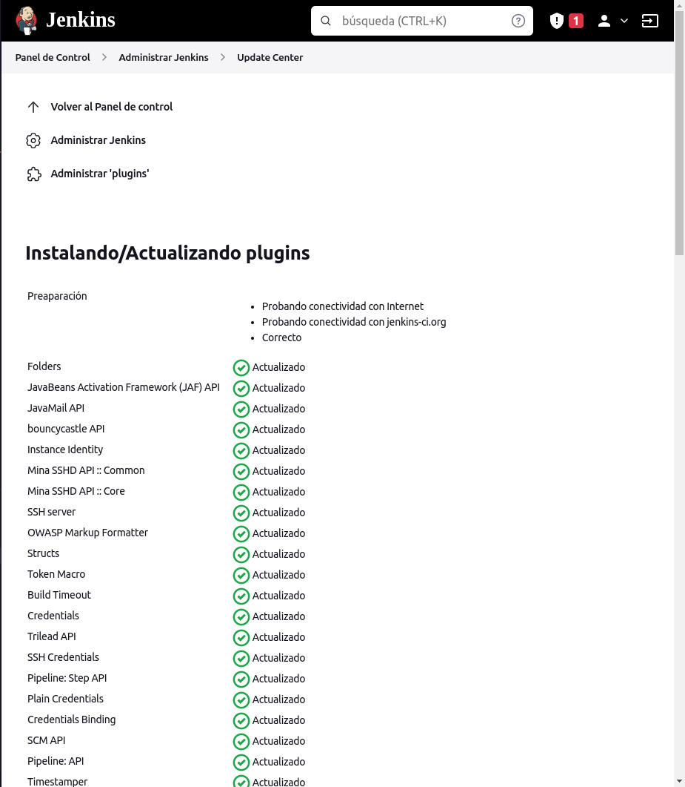
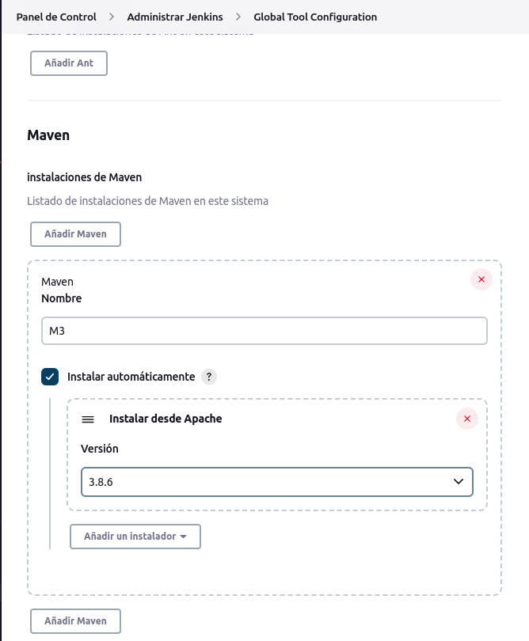
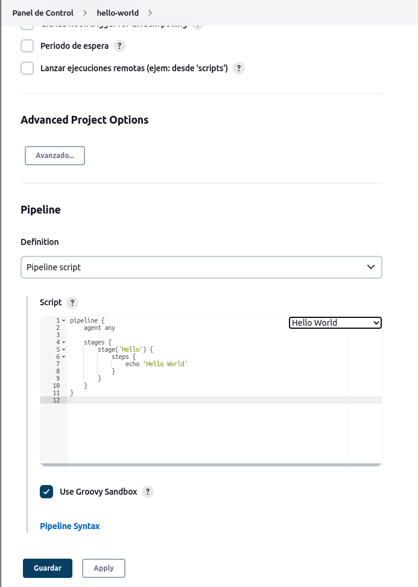
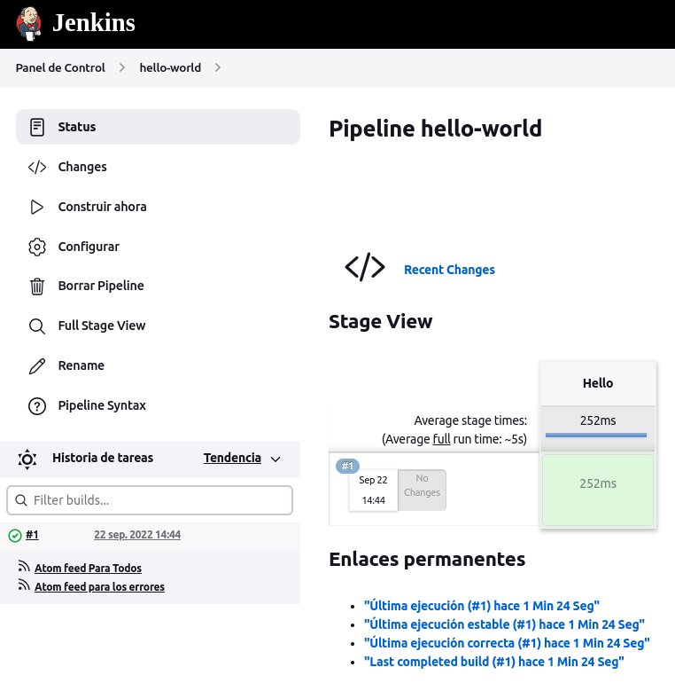
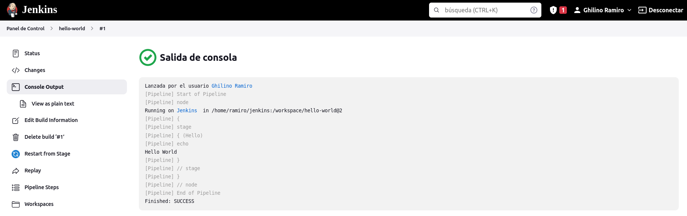
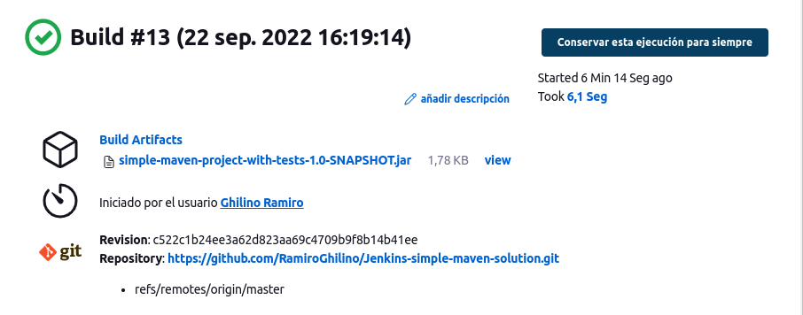
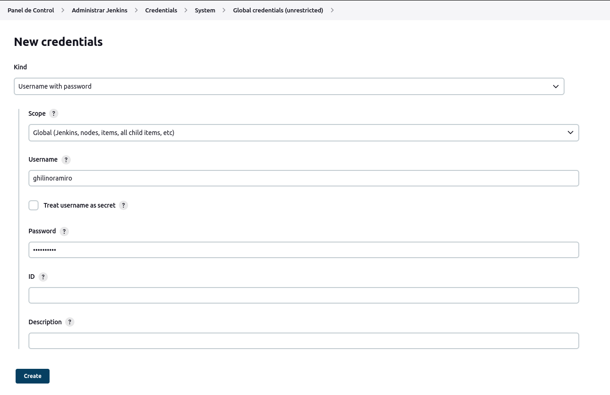
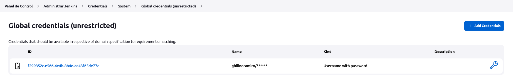
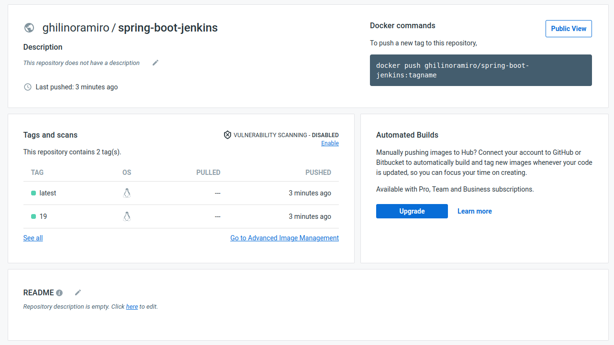

# Trabajo Práctico 7 - Servidor de Build (de integración continua)

## 1 - Poniendo en funcionamiento Jenkins

Luego de completar los pasos:



## 2 - Conceptos Generales

Preguntar si se completa con el profe o solos.

## 3 - Instalando Plugins y configurando herramientas

Instalando el Plugin:



Instalando Maven:



## 4 - Creando el primer Pipeline Job

Creo el Pipeline Hello-World y cerca del final de la página elijo el sample de código hello-world:



Ahora lo ejecuto:



Y si observamos las salidas de consola:



Como podemos observar, Jenkins de manera automática ejecutó línea por línea nuestro código.

## 5 - Creando un Pipeline Job con Git y Maven

Modifiqué el repositorio que se utiliza por uno propio con el pom modificado: https://github.com/RamiroGhilino/Jenkins-simple-maven-solution.git 



## 6 - Utilizando nuestros proyectos

Para este paso cree un nuevo repositorio que solo contiene el código de `spring-boot`del TP6. El reposotorio se puede ver [aquí](https://github.com/RamiroGhilino/ing-sw-3-spring-boot)


El código utilizado en el pipeline de Jenkins es el siguiente:

```
pipeline {
    agent any

    tools {
        // Install the Maven version configured as "M3" and add it to the path.
        maven "M3"
    }

    stages {
        stage('Build') {
            steps {
                // Get some code from a GitHub repository
                git branch: "main", url: 'https://github.com/RamiroGhilino/ing-sw-3-spring-boot.git'

                // Run Maven on a Unix agent.
                sh "mvn -Dmaven.test.failure.ignore=true clean package"

                // To run Maven on a Windows agent, use
                // bat "mvn -Dmaven.test.failure.ignore=true clean package"
            }

            post {
                // If Maven was able to run the tests, even if some of the test
                // failed, record the test results and archive the jar file.
                success {
                    junit '**/target/surefire-reports/TEST-*.xml'
                    archiveArtifacts 'target/*.jar'
                }
            }
        }
    }
}
```

También se encuntra en `TP7/spring-boot/Jenkinsfile`. 

Ahora podemos observar los resultados:


## 7 -  Utilizando nuestros proyectos con Docker

En mi caso cree las credenciales para iniciar sesión en docker hub:





Ahora voy a utilizar estas credenciales para loggearme con el plugin, crear el tag y publicar en docker hub: 

```
pipeline {
    agent any
    
    tools {
        // Install the Maven version configured as "M3" and add it to the path.
        maven "M3"
    }

    stages {
        stage('Build') {
            steps {
                // Get some code from a GitHub repository
                git branch: "main", url: 'https://github.com/RamiroGhilino/ing-sw-3-spring-boot.git'

                // Run Maven on a Unix agent.
                sh "mvn -Dmaven.test.failure.ignore=true clean package"

                // To run Maven on a Windows agent, use
                // bat "mvn -Dmaven.test.failure.ignore=true clean package"
            }

            post {
                // If Maven was able to run the tests, even if some of the test
                // failed, record the test results and archive the jar file.
                success {
                    junit '**/target/surefire-reports/TEST-*.xml'
                    archiveArtifacts 'target/*.jar'
                }
            }
        }
        
        stage('Docker Process') {
            steps{
                script{
                    def image = docker.build "ghilinoramiro/spring-boot-jenkins"
                    docker.withRegistry('https://registry.hub.docker.com', 'docker-hub-credentials') {
                        image.push("${env.BUILD_NUMBER}")
                        image.push("latest")
                    }
                }
            }
        }
    }
}
```

Como podemos ver, se encuentra en [docker hub](https://hub.docker.com/repository/docker/ghilinoramiro/spring-boot-jenkins)





Para poder completar este paso tuve algunos problemas ya que jenkins no conocía docker al momento de correr el script por lo que tuve que generar mi propia imagen de jenkins e instalar docker adentro de esta, el `dockerfile` utilizado para esto se puede encontrar [aquí](/TP7/JenkinsDockerfile/dockerfile).

Luego de crear este archivo debemos hacer build con el comando `docker image build -t [nombre-imagen] .` 

Luego utilizo el comando `docker run -it --rm -v /var/run/docker.sock:/var/run/docker.sock -v ~/jenkins:/var/jenkins_home -p 8082:8080 -p 50000:50000 [nombre-imagen]`

En mi caso indico el mismo directorio de jenkins que utilicé para la imagen anterior (la que no conocía docker) para no perder los pipelines, credenciales, plugins y demás.