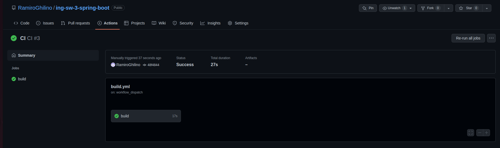
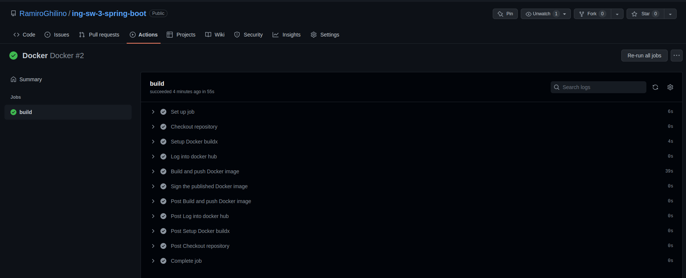
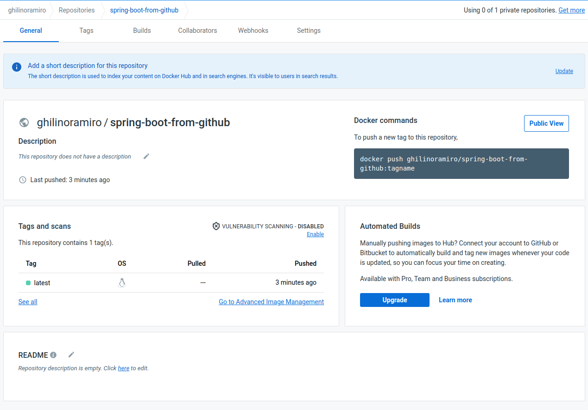
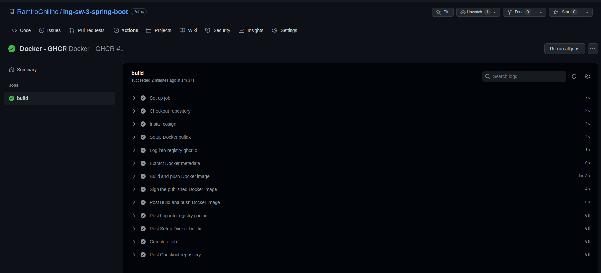
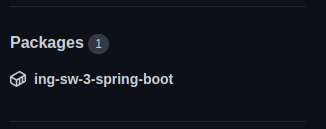

# Trabajo Práctico 8 - Herramientas de construcción de software en la nube

## 1 - Pros y Contras

## 2 - Configurando GitHub Actions

El archivo del workflow `build_maven.yml` se puede ver [aquí](/TP8/build_maven.yml) o en el [repositorio](https://github.com/RamiroGhilino/ing-sw-3-spring-boot.git) creado para el TP7 y este punto.

**Nota**: Como se puede ver en el archivo, se modificó el path ya que este repositorio solo posee el código necesario para la construcción, si otros repositorios tuvieran mas código que el neceseario habría que ser mas específico.

Luego de ejecutar manualmente:

Este pipeline accede al repositorio mediante `actions/checkout@v2`, settea JDK, y luego corre el comando que establecimos para construir el proyecto con Maven.

## 3- Utilizando nuestros proyectos con Docker

En este caso vemos como el nuevo workflow funciona y publica correctamente la imagen en docker hub. Al igual que el archivo anterior, se puede ver el código del archivo `Docker-Hub-Publish.yml` [aquí](./Docker-Hub-Publish.yml) o en el [repositorio del spring-boot](https://github.com/RamiroGhilino/ing-sw-3-spring-boot.git). 

Adicionalmente agrego un tercer workflow que utiliza el servicio de Github: Container Registry. 

Como resultado, ahora tenemos el Package creado y disponible en nuestro repositorio para cualquiera que lo visite:

