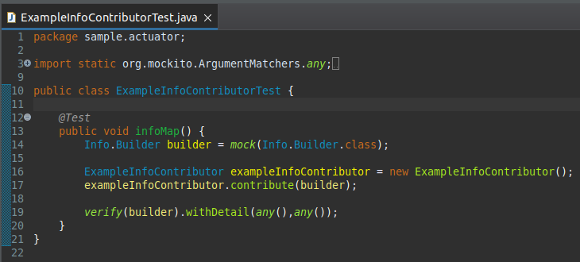
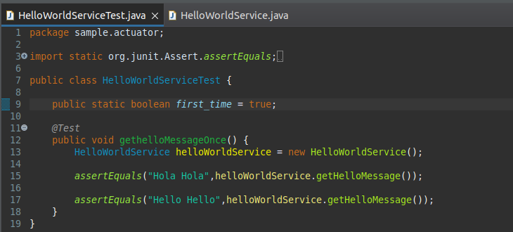
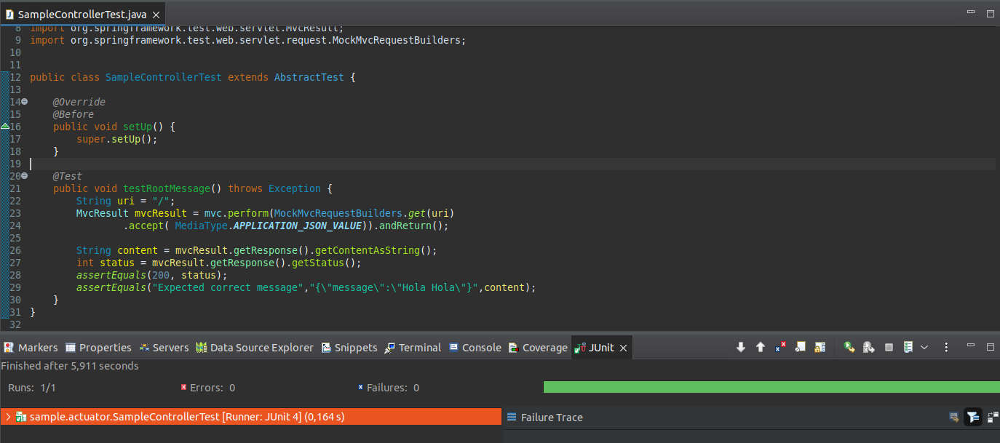
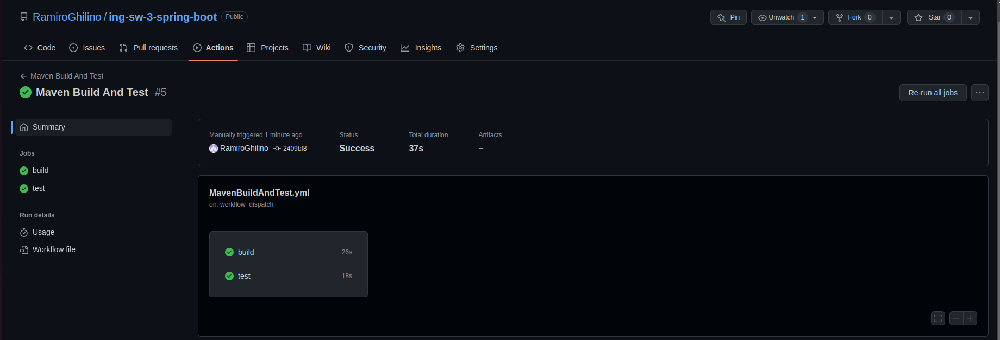

# Trabajo Práctico 9 - Pruebas de unidad

## 4 - Desarrollo 

### 2 - Utilizando Unit test 

Como se puede ver en la [página oficial de javatpoint](https://www.javatpoint.com/spring-boot-starters) la dependencia *"Se utiliza para probar aplicaciones Spring Boot con bibliotecas, incluidas JUnit, Hamcrest y Mockito."*

Desde Eclipse corro los unit test:

### 3 - Familiarizarse con algunos conceptos de Mockito

En este Unit Test podemos observar como con la ayuda de Mockito se imitan las funcionalidades de clases externas para poder comprobar el funcionamiento adecuado de las mismas, en este caso la clase es Info.Builder . 

### 4 - Utilizando Mocks

Luego de crear las 2 clases de test nuevas:

Estas clases test nos demuestran como puede implementarse la herencia incluso en los test.

La clase SampleControlletTest instancia una versión web de nuestro código, comprueba que reciba un status 200 (Ok) y luego que nuestra clase HelloWorldService funcione correctamente mostrando el mensaje indicado en los puntos anteriores.

### 6 - Capturar los unit tests como parte del proceso de CI/CD

Para lograr lo solicitado es necesario agregar un nuevo job al archivo `.yml` que utilizamos antes

El archivo utilizado para el nuevo actions se puede ver [aquí.](./BuildAndTest.yml)

